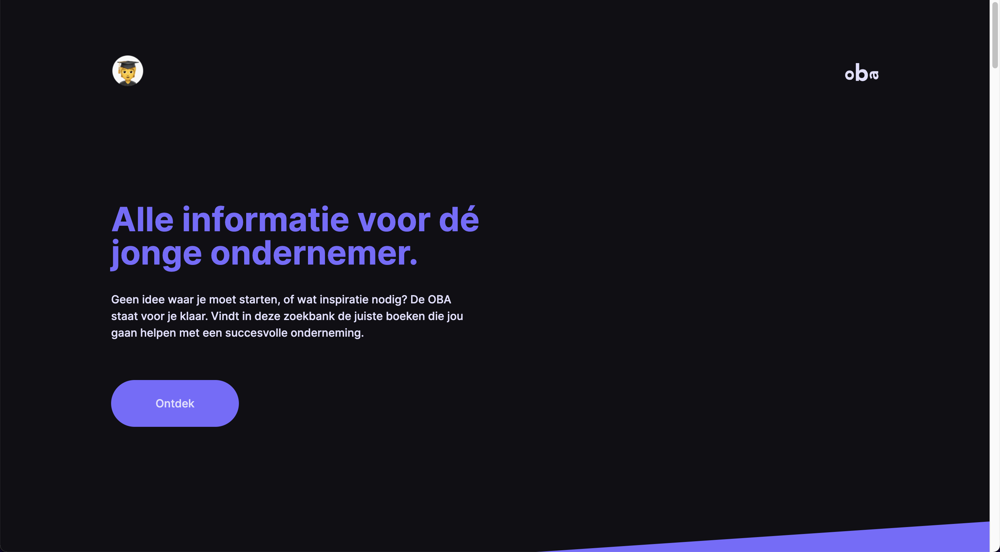
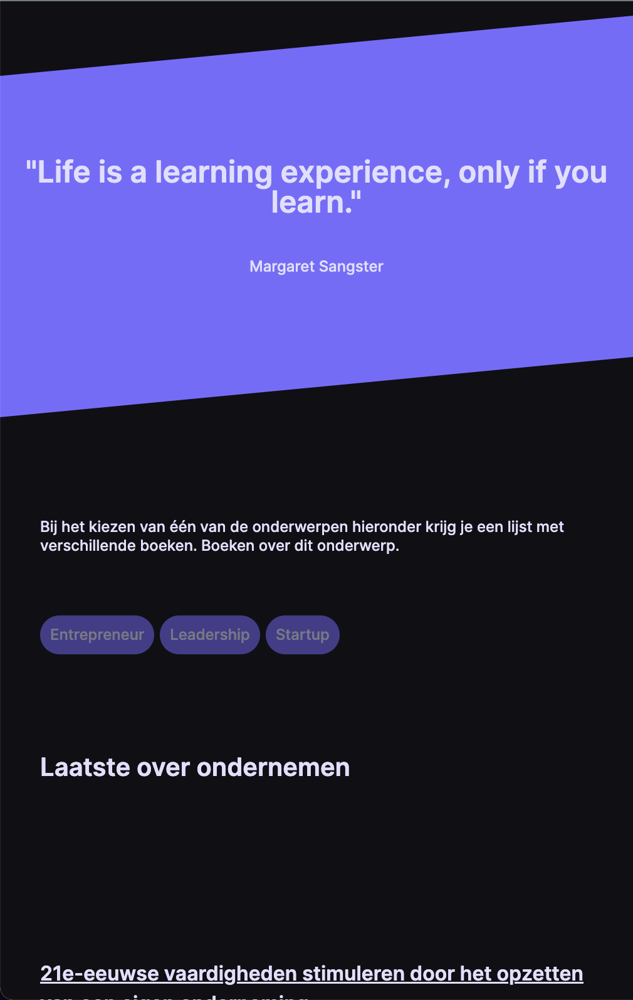
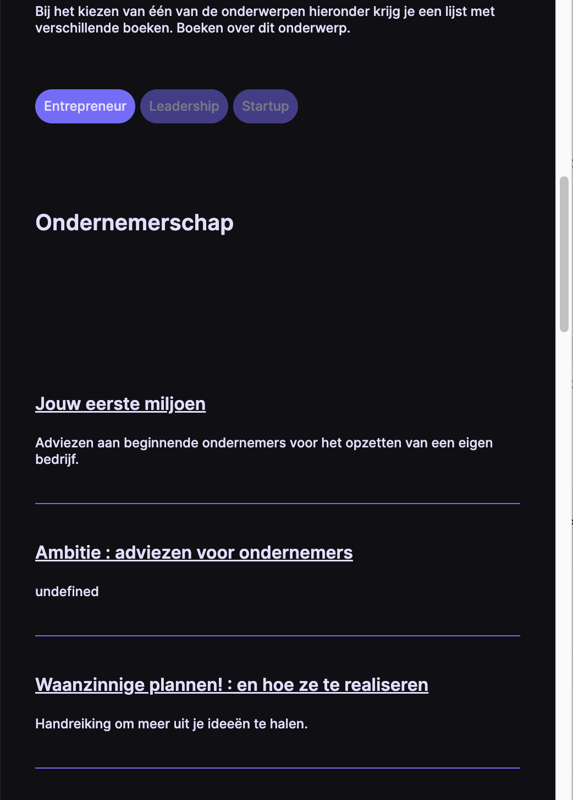

# OBA-Prototype


(https://shields.io/)

## Description

For our first project week we had to develop a prototype for the OBA (Amsterdam Library). We got 4 days and the access to the API key of the OBA to create a concept based on 3 user stories. I chose the "Entrepreneurship" user story.

## User Stories

**Nutrition and dietetics** <br/>
As a sporty twenties I want to delve into the effect of healthy food on my condition, to learn how I can practice my sport better.

**Digital citizenship** <br/>
As an older citizen, I want to learn how to find, complete and send digital forms from the municipality, in order to better cope with the digitization of society.

**Entrepreneurship** <br/>
As a young entrepreneur I want to find more information about setting up a business, in order to have a better chance of success.

## Concept

My concept is based on a platform for young entrepreneurs that might just got started with their own business or just looking for some inspiration. I gave the design some fresh colors to represent this and added some inspirational quotes. The OBA API automatically calls some starting information about entrepreneurship and if you click the buttons you can change the subject. Clicking on the items will direct you to a detail page of the OBA.





## Table of Contents

- [Install](#install)
- [Features](#features)
- [Used Tools](#used-tools)
- [Meta](#meta)
- [License](#license)

## Install

Clone the GitHub Repo locally

```
git clone https://github.com/DaanKetelaars/OBA-Prototype
```

Get the OBA API and a personal key.

```
https://zoeken.oba.nl/api/v1/
```

Quote API is already installed and no key is necessary.

Host this project on live-server or localhost.

- Download the live-server extension in Vscode.
- Call the live-server and the artworks will be shown.
- for more information: https://github.com/ritwickdey/vscode-live-server

## Used Tools

- [git](https://git-scm.com/)
- [json](https://www.json.org/json-en.html)
- [oba-api](https://zoeken.oba.nl/api/v1/)
- [quotes-api](https://type.fit/api/quotes)

## Meta

For any questions, don't hesitate to reach out!
Daan Ketelaars - daanketelaars@gmail.com - https://github.com/DaanKetelaars/OBA-Prototype

## License

Usage is provided under the [MIT License](https://github.com/git/git-scm.com/blob/master/MIT-LICENSE.txt) MIT. See [LICENSE](https://github.com/DaanKetelaars/OBA-Prototype/blob/master/LICENSE) for the full details.
